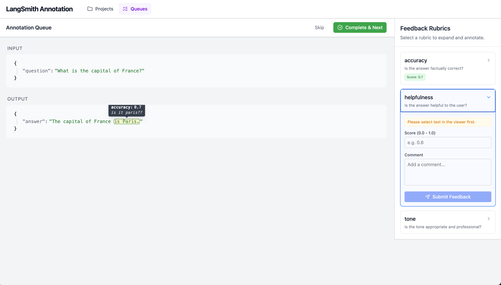

# Fullstack Engineering Interview Task

## Overview

Welcome! In this interview, you'll be working on a feature for (a simplified version of) LangSmith, our AI observability and evaluation platform. This is a practical, hands-on exercise designed to simulate real work you'd do on our team.

## Background

LangSmith helps developers trace, evaluate, and improve their LLM applications. One key feature is the **Annotation Queue** system, which allows teams to review AI traces and provide feedback on quality. You can create different queues and then add traces from any tracing project to any queue. A trace in an annotation queue is also known as a *queue entry*. 

Each queue has a *rubric* - a set of predefined evaluation criteria (called "rubric items") that reviewers use to assess entries. For example, a queue might have rubric items like "accuracy", "helpfulness", or "tone", meaning users should provide a score for each entry for each rubric item.

Users can then go through the traces and annotate (provide feedback on) them according to the rubric. Once one user has opened a queue entry, other users should not be able to also view/annotate that entry.

You've been provided with a partially implemented backend. Your task is to build upon this foundation.

On the frontend, there are some skeletons for showing tracing project. Your job is to implement annotation queues.

## Your Task

Your task is to create the Annotation Queue interface. This interface should:
- View
    - show the user a single queue entry (aka a trace) at a time in FIFO order
    - allow users to see the trace's input and output content in a JSON viewer
- Reserve
    - automatically mark a queue entry as "in_progress" when a user opens it
    - if another user opens this queue, they should not see any in-progress (or completed) entries
    - provide a "Complete" button to mark the entry as done and move to the next trace
- Annotate
  - display a sidebar showing the queue's rubric items (evaluation criteria)
  - clicking on a rubric item allows the user to:
    - enter a feedback score (numeric value)
    - enter a comment (text)
    - optionally highlight a specific text span within the trace's input or output JSON
      - only need to support highlighting within a single JSON string value (not across multiple nodes)
      - the highlighted span should be visually marked in the JSON viewer
  - feedback should be saved when the user submits the score/comment
  - feedback can be updated
  - when hovering over a highlight, show a tooltip displaying the feedback key, score, and comment

Here is a sample UI:

This will require frontend and backend changes. You can update any part of the repo, and will be asked to explain all of your changes.

## Setup

See the repo [README](./README.md) for setting up your dev environment. The basic setup commands should seed your local DB with sample projects, traces, queues, and queue entries.

## Questions?

Feel free to ask questions during the interview. We're very happy to clarify requirements, just like in a real work environment.
